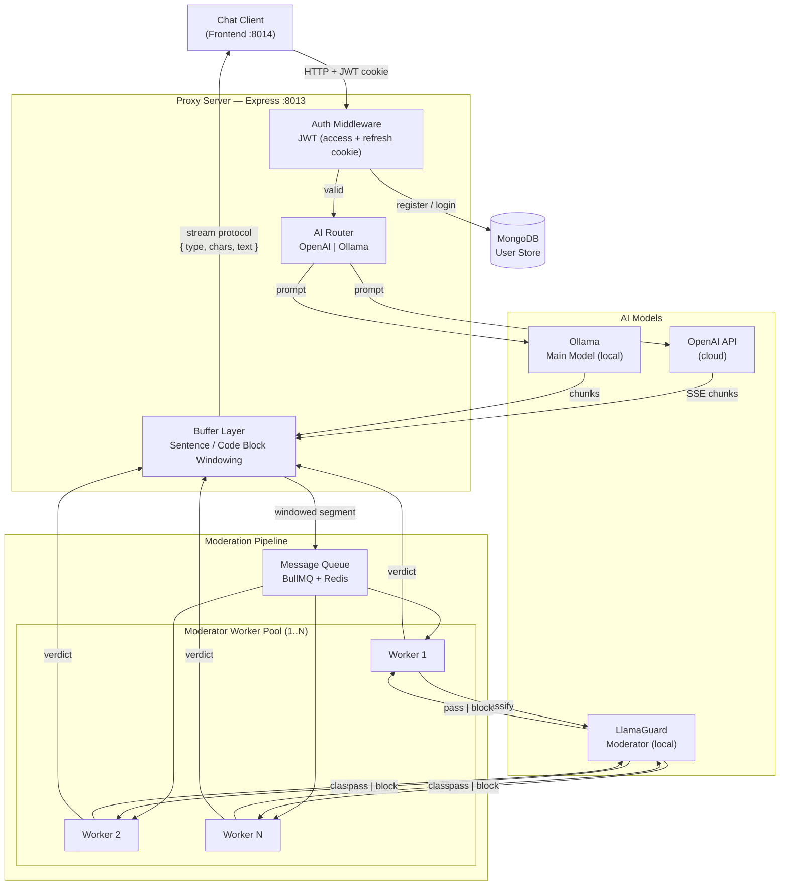
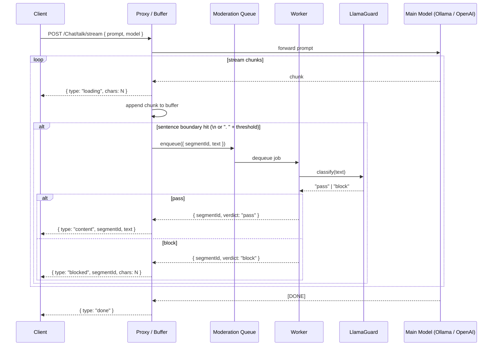
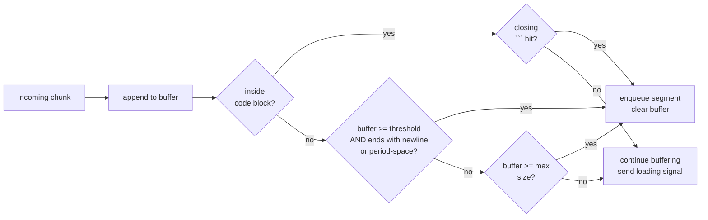

# Arbiter

> A streaming-aware AI moderation proxy. Sits between your chat client and any AI provider, moderating content sentence-by-sentence before it reaches the user — without killing the streaming experience.

---

## The Problem

AI providers stream responses token by token. Traditional content moderation works on complete text. Bolting a moderator onto a streaming pipeline means either:

- **Buffering the entire response** before sending — which kills the UX, or
- **Releasing everything unmoderated** and retracting after — unacceptable for safety-critical applications like a child-facing product.

Arbiter solves this with a **windowed streaming moderation** approach.

---

## How It Works

Instead of buffering the full response or moderating per-token, Arbiter uses natural language boundaries as moderation windows:

- **Text:** window = one sentence (newline or `. ` above a character threshold)
- **Code:** window = one complete code block (` ``` ` open → ` ``` ` close)

While a window is accumulating, the client receives `{ type: "loading", chars: N }` — enough information to render a realistic blurred/skeleton placeholder. Once the window closes, the segment is classified. If it passes, the real text is sent. If it is blocked, only the character count is sent — the placeholder stays blank.

This means the user always sees *something* forming, latency is bounded per sentence, and no harmful content is ever released to the client.

---

## Architecture



---

## Streaming Moderation Flow



---

## Wire Protocol

All messages from Arbiter to the client follow this shape:

| type | fields | meaning |
|------|--------|---------|
| `loading` | `chars: number` | segment is accumulating, here is its current size |
| `content` | `segmentId: number`, `text: string` | segment passed moderation, here is the text |
| `blocked` | `segmentId: number`, `chars: number` | segment was blocked, render a blank of this size |
| `done` | — | stream ended |

The `chars` field on `loading` and `blocked` lets the frontend render a proportional placeholder without ever knowing the content.

---

## Windowing Strategy



The minimum character threshold prevents false splits on abbreviations (`Mr.`, `U.S.A.`, `3.14`). The max size cap guarantees a flush even for very long run-on sentences.

---

## API Reference

### User

| Method | Endpoint | Auth | Description |
|--------|----------|------|-------------|
| `POST` | `/User/register` | — | Create a new account |
| `POST` | `/User/login` | — | Login, sets `accessToken` + `refreshToken` cookies |
| `GET` | `/User/refresh` | — | Reissue access token using refresh cookie |
| `GET` | `/User/verify` | — | Check if current access token is valid |
| `GET` | `/User/logout` | — | Clear both auth cookies |

### Chat

All chat endpoints require a valid `accessToken` cookie.

| Method | Endpoint | Description |
|--------|----------|-------------|
| `GET` | `/Chat/health` | Health check |
| `POST` | `/Chat/talkBasic` | Non-streaming chat via OpenAI |
| `POST` | `/Chat/talkStream` | Streaming chat via OpenAI (SSE) |
| `POST` | `/Chat/talk/basic` | Non-streaming chat via Ollama |
| `POST` | `/Chat/talk/stream` | Streaming chat via Ollama |
| `GET` | `/Chat/listModels` | List locally installed Ollama models |
| `GET` | `/Chat/listModels/openAi` | List available OpenAI models |

#### Request body — `/Chat/talk/:mode`
```json
{
  "model": "llama3.2",
  "prompt": "Explain recursion simply."
}
```

#### Request body — `/Chat/talkBasic` / `/Chat/talkStream`
```json
{
  "messages": [
    { "role": "user", "content": "Hello!" }
  ]
}
```

---

## Getting Started

### Prerequisites

- Node.js 18+
- MongoDB Atlas account (or local instance)
- [Ollama](https://ollama.com) installed and running locally (for local model support)
- OpenAI API key (for cloud model support)

### Install

```bash
git clone https://github.com/zuhailkhan/arbiter.git
cd arbiter
npm install
```

### Configure

Copy the example env file and fill in your values:

```bash
cp .env.example .env
```

### Run

```bash
# development
npm run dev

# production
npm run build && npm start
```

Server starts on `http://localhost:8013`.

---

## Environment Variables

| Variable | Description |
|----------|-------------|
| `PORT` | Server port (default: `8013`) |
| `ACCESS_SECRET` | JWT secret for access tokens |
| `REFRESH_SECRET` | JWT secret for refresh tokens |
| `OPENAI_API_KEY` | OpenAI API key |
| `MONGO_USERNAME` | MongoDB Atlas username |
| `MONGO_PASSWORD` | MongoDB Atlas password |
| `MONGO_CLUSTER` | MongoDB Atlas cluster hostname |

---

## Tech Stack

| Layer | Technology |
|-------|-----------|
| Runtime | Node.js + TypeScript |
| Framework | Express.js |
| Auth | JWT (httpOnly cookies) |
| Database | MongoDB + Mongoose |
| Local AI | Ollama |
| Cloud AI | OpenAI API |
| Streaming | Fetch API (ReadableStream) + SSE |

---

## Current State

| Feature | Status |
|---------|--------|
| User auth (register, login, refresh, logout) | Done |
| OpenAI basic + streaming chat | Done |
| Ollama basic + streaming chat | Done |
| Multi-model routing | Done |
| Buffer layer (windowed segmentation) | Planned |
| Moderation queue (BullMQ + Redis) | Planned |
| LlamaGuard worker pool | Planned |
| Wire protocol implementation | Planned |
| Frontend skeleton/blur UI | Planned |

---

## Roadmap

- [ ] Implement sentence/code block buffer layer
- [ ] Integrate BullMQ + Redis moderation queue
- [ ] LlamaGuard worker pool with configurable concurrency
- [ ] Wire protocol over SSE to client
- [ ] Per-user moderation audit log
- [ ] Configurable moderation rules per deployment (e.g. child-safe, general, enterprise)
- [ ] Dashboard for moderation stats

---

## Why Not Just Use OpenAI's Moderation API?

- Tied to one provider — Arbiter works with any model, including fully local ones
- Doesn't handle streaming — it operates on complete text after the fact
- Not self-hostable — data leaves your infrastructure
- Not composable — you can't plug in a custom classifier

Arbiter's goal is to be **provider-agnostic, self-hostable, streaming-native moderation infrastructure**.

---

## License

ISC
